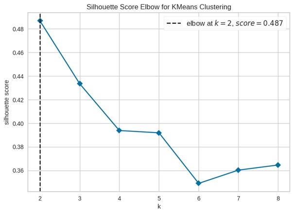

# PORCUPINE
**P**rincipal Components Analysis to **O**btain **R**egulatory **C**ontributions **U**sing **P**athway-based Interpretation of **N**etwork **E**stimates is an R package to identify biological pathway which drive inter-tumour heterogeneity in a population of gene regulatory networks. It is a Principal Components Analysis (PCA)-based approach that can be used to determine whether a specific set of variables—for example a set of genes in a specific pathway—have coordinated variability in their regulation.

## Method
PORCUPINE uses as input individual patient networks, for example networks modeled using PANDA and LIONESS, as well as a .gmt file that includes biological pathways and the genes belonging to them. For each pathway, it extracts all edges connected to the genes belonging to that pathway and scales each edge across individuals. It then performs a PCA analysis on these edge weights, as well as on a null background that is based on random pathways. To identify significant pathways, PORCUPINE applies a one-tailed t-test and calculates the effect size (ES). Here we provide an example of how we analyzed heterogeneity among single gene regulatory asmple networks in Leiomyosarcomas (LMS).  Networks were obtained with PANDA and LIONESS algorithms. Our  dataset contains data for 80 TCGA LMS patient-specific gene regulatory networks. 

## Setup
The requirements are provided in a requirements.txt file.
Install package 
```{r}
pip install netzoo_porcupine
```

## Usage
```{r}
import netzoo_porcupine as pcp
import statsmodels.stats.multitest as smm
```
First, we load the network data (80_tcga_lms_net.RData) and edges information (rand_genes.RData). Data files are available here : https://zenodo.org/records/8105729.
In this example, we have patient-specific gene regulatory networks for 80 TCGA leiomyosarcoma patients.
The first three columns in the data provide information on the regulators (TFs) and target genes. 
Edges information includes three columns: reg (the transcription factor's gene symbol),tar (Ensembl ID), prior (whether an edge is prior (1) or not (0)).

```{r}
net_file_path = "/div/pythagoras/u1/rosaliec/80_tcga_lms_net.RData"
edges_file_path = "/div/pythagoras/u1/rosaliec/edges.RData"
net, edges = pcp.load_data(net_file_path, edges_file_path)


#   0E244FE2-7C17-4642-A51F-2CCA796D9C70  75435ED8-93E8-45FB-8480-98D8EB2EF8CB  \
#0                                  0.76                                  0.10   
#1                                  0.94                                  1.43   
#2                                  1.09                                  2.78   
#3                                  1.13                                  2.60   
#4                                 -0.71                                 -1.42   
#
#   B6D11678-15A9-4F43-A0A2-225067DCAF1C  B7F5A41E-9559-4329-81F5-1B88A74730B7  \
#0                                 -1.27                                  0.01   
#1                                  0.30                                  0.91   
#2                                  1.01                                  2.13   
#3                                  1.66                                  1.71   
#4                                  0.02                                  0.27   
#
#   04823F53-A12D-4852-8F34-77B9DCBB7DF0  49684C2B-D31C-4B45-A400-3497C3CCEC01  \
#0                                 -7.18                                  2.74   
#1                                 -5.69                                  2.43   
#2                                 -6.09                                  3.23   
#3                                 -6.04                                  2.88   
#4                                  5.31                                 -1.02   
#
#   FFDD7A12-DDEF-4974-8D60-64B7EEAAC994  830DFA6F-A85A-4317-82B2-791FAB998A01  \
#0                                 -0.80                                 -0.31   
#1                                 -1.55                                 -2.56   
#2                                  1.04                                 -2.07   
#...
#3                                  0.13  
#4                                 -0.06 


print(edges.head())

#    reg   tar  prior
#0  AIRE  A1BG    0.0
#1  ALX1  A1BG    0.0
#2  ALX3  A1BG    0.0
#3  ALX4  A1BG    0.0
#4    AR  A1BG    0.0

print(len(edges['reg'].unique()))
#623

print(len(edges['tar'].unique()))
#17899

```
Our individual networks are represented by interactions between 623 TFs and 17,899 target genes.
Then, we need to load in pathway file (.gmt file) available in the data folder. 

```{r}
pathways_file_path = "/div/pythagoras/u1/rosaliec/c2.cp.reactome.v7.1.symbols.gmt"
pathways = pcp.load_gmt(pathways_file_path)
print(len(pathways))
#1532
```
We need to filter pathways in order to include only pathways with genes that are present in our network file. 
```{r}
pathways_filt=pcp.filter_pathways(pathways,edges)
print(len(pathways_filt))
#1531

```
Then, we filter pathways based on their size, and all pathways with less than 10 and more than 150 genes are filtered out. 
```{r}
pathways_to_use=pcp.filter_pathways_size(pathways_filt,5,150)
print(len(pathways_to_use))
#1411
```
We select the top 10 pathways for the analysis (just to reduce computational time).
```{r}
pathways_to_use=pathways_to_use[0:10]
```
Next, we perform PCA analysis for the 10 selected pathawys and extact the information on the variance explained by the first principal component in each pathway.
```{r}
pca_res_pathways=pcp.pca_pathway(pathways_to_use, net, edges,scale_data = True, center_data = True)
print(pca_res_pathways)
#                                             pathway        pc1  n_edges  \
#0         REACTOME_GLYCOGEN_BREAKDOWN_GLYCOGENOLYSIS  16.787642     8099   
#1                     REACTOME_PYRIMIDINE_CATABOLISM  23.986634     7476   
#2  REACTOME_INHIBITION_OF_THE_PROTEOLYTIC_ACTIVIT...  18.545908    12460   
#3  REACTOME_PYRUVATE_METABOLISM_AND_CITRIC_ACID_T...  20.999699    32396   
#4   REACTOME_APOPTOTIC_CLEAVAGE_OF_CELLULAR_PROTEINS  16.808329    21182   
#5  REACTOME_ACTIVATION_OF_THE_PRE_REPLICATIVE_COM...  20.919336    20559   
#6        REACTOME_PROCESSING_OF_INTRONLESS_PRE_MRNAS  18.129761    10591   
#7                  REACTOME_GAP_JUNCTION_DEGRADATION  37.223203     7476   
#8                      REACTOME_BASE_EXCISION_REPAIR  14.640845    27412   
#9        REACTOME_BILE_ACID_AND_BILE_SALT_METABOLISM  21.326899    26789   
#
#   pathway_size  
#0            13  
#1            12  
#2            20  
#3            52  
#4            34  
#5            33  
#6            17  
#7            12  
#8            44  
#9            43  
```
Then we perform a PCA analysis based on random gene sets. In this case we create 50 random gene sets for each pathway and run PCA for each gene set. This is just an example, for real comparisons we recommend to set n_perm to 1000.

```{r}
pca_res_random = pcp.pca_random(net, edges, pca_res_pathways, pathways_filt, n_perm = 50, scale_data= True, center_data = True)
```
Then to identify significant pathways we run PORCUPINE, which compares the observed PCA score for a pathway to a set of PCA scores of random gene sets of the same size as pathway. Calculates p-value and effect size.
```{r}
res_porcupine = pcp.porcupine(pca_res_pathways,pca_res_random)
#P_adjust calculation using FDR method (Benjamini-Hochberg)
import statsmodels.stats.multitest as smm
res_porcupine['p.adjust'] = smm.multipletests(res_porcupine['pval'], method='fdr_bh')[1]
print(res_porcupine)

#Pathways with size 13
#Pathways with size 12
#Pathways with size 20
#Pathways with size 52
#Pathways with size 34
#Pathways with size 33
#Pathways with size 17
#Pathways with size 44
#Pathways with size 43
#                                             pathway  pathway_size        pc1  \
#0         REACTOME_GLYCOGEN_BREAKDOWN_GLYCOGENOLYSIS            13  16.787642   
#1                     REACTOME_PYRIMIDINE_CATABOLISM            12  23.986634   
#2                  REACTOME_GAP_JUNCTION_DEGRADATION            12  37.223203   
#3  REACTOME_INHIBITION_OF_THE_PROTEOLYTIC_ACTIVIT...            20  18.545908   
#4  REACTOME_PYRUVATE_METABOLISM_AND_CITRIC_ACID_T...            52  20.999699   
#5   REACTOME_APOPTOTIC_CLEAVAGE_OF_CELLULAR_PROTEINS            34  16.808329   
#6  REACTOME_ACTIVATION_OF_THE_PRE_REPLICATIVE_COM...            33  20.919336   
#7        REACTOME_PROCESSING_OF_INTRONLESS_PRE_MRNAS            17  18.129761   
#8                      REACTOME_BASE_EXCISION_REPAIR            44  14.640845   
#9        REACTOME_BILE_ACID_AND_BILE_SALT_METABOLISM            43  21.326899   
#
#           pval        es      p.adjust  
#0  1.000000e+00  0.963420  1.000000e+00  
#1  2.007815e-05  0.638230  5.019538e-05  
#2  9.465539e-36  4.740924  9.465539e-35  
#3  9.997105e-01  0.520523  1.000000e+00  
#4  3.203126e-07  0.808265  1.601563e-06  
#5  1.000000e+00  1.275528  1.000000e+00  
#6  6.475769e-03  0.364771  1.295154e-02  
#7  9.998534e-01  0.551486  1.000000e+00  
#8  1.000000e+00  1.724658  1.000000e+00  
#9  2.898786e-06  0.718975  9.662619e-06  
```
Significant pathways can be selected based on adjusted p-value, explained variance and effect size. 


To obtain pathway-based patient heterogeneity scores on the first two principal components.
```{r}
ind_res = pcp.get_pathway_ind_scores(pathways_to_use, net,edges, scale_data = True, center_data = True)
print(ind_res[0:10])
#                                                                         pathway  \
#0E244FE2-7C17-4642-A51F-2CCA796D9C70  REACTOME_GLYCOGEN_BREAKDOWN_GLYCOGENOLYSIS   
#75435ED8-93E8-45FB-8480-98D8EB2EF8CB  REACTOME_GLYCOGEN_BREAKDOWN_GLYCOGENOLYSIS   
#B6D11678-15A9-4F43-A0A2-225067DCAF1C  REACTOME_GLYCOGEN_BREAKDOWN_GLYCOGENOLYSIS   
#B7F5A41E-9559-4329-81F5-1B88A74730B7  REACTOME_GLYCOGEN_BREAKDOWN_GLYCOGENOLYSIS   
#04823F53-A12D-4852-8F34-77B9DCBB7DF0  REACTOME_GLYCOGEN_BREAKDOWN_GLYCOGENOLYSIS   
#49684C2B-D31C-4B45-A400-3497C3CCEC01  REACTOME_GLYCOGEN_BREAKDOWN_GLYCOGENOLYSIS   
#FFDD7A12-DDEF-4974-8D60-64B7EEAAC994  REACTOME_GLYCOGEN_BREAKDOWN_GLYCOGENOLYSIS   
#830DFA6F-A85A-4317-82B2-791FAB998A01  REACTOME_GLYCOGEN_BREAKDOWN_GLYCOGENOLYSIS   
#58578614-E4A3-4655-BBAB-F65851625E0A  REACTOME_GLYCOGEN_BREAKDOWN_GLYCOGENOLYSIS   
#4139E0C9-F712-4A25-8B59-587533B93B3E  REACTOME_GLYCOGEN_BREAKDOWN_GLYCOGENOLYSIS   
#
#                                          Dim.1      Dim.2  
#0E244FE2-7C17-4642-A51F-2CCA796D9C70  -0.124027  -7.807079  
#75435ED8-93E8-45FB-8480-98D8EB2EF8CB  20.641956  -6.844048  
#B6D11678-15A9-4F43-A0A2-225067DCAF1C   6.240503  -8.771506  
#B7F5A41E-9559-4329-81F5-1B88A74730B7  24.644962  -0.103552  
#04823F53-A12D-4852-8F34-77B9DCBB7DF0  -8.556204  -4.645454  
#49684C2B-D31C-4B45-A400-3497C3CCEC01   2.916440 -21.810588  
#FFDD7A12-DDEF-4974-8D60-64B7EEAAC994  12.886658 -15.456415  
#830DFA6F-A85A-4317-82B2-791FAB998A01  39.929420   5.942546  
#58578614-E4A3-4655-BBAB-F65851625E0A -10.705200 -19.711465  
#4139E0C9-F712-4A25-8B59-587533B93B3E -95.639682  60.061360  
```
PORCUPINE allows to identify patient subtypes based on gene regulatory networks for each of the significant pathways. For this, K-means clustering is applied to the pathway-based patient heterogeneity scores on the first two principal components.
The optimal number of clusters can be determined prior to clustering using the Average Silhouette Method.

Here we provide example of stratifying patients based on the “REACTOME VITAMIN B5 PANTOTHENATE METABOLISM” pathway.
```{r}
print(pathways[37])
#('REACTOME_VITAMIN_B5_PANTOTHENATE_METABOLISM', ['COASY', 'VNN1', 'VNN2', 'PANK3', 'PDZD11', 'SLC25A16', 'PANK2', 'PPCS', 'ENPP2', 'SLC5A6', 'PPCDC', 'AASDHPPT', 'PANK1', 'ENPP3', 'PANK4', 'FASN', 'ENPP1'])

```
```{r}
pcp.select_number_clusters(pathways[37],net, edges)
#The optimal number of clusters is 2. To visualize clusters
pcp.visualize_clusters(pathways[37], net, edges, number_of_clusters = 2)
```

